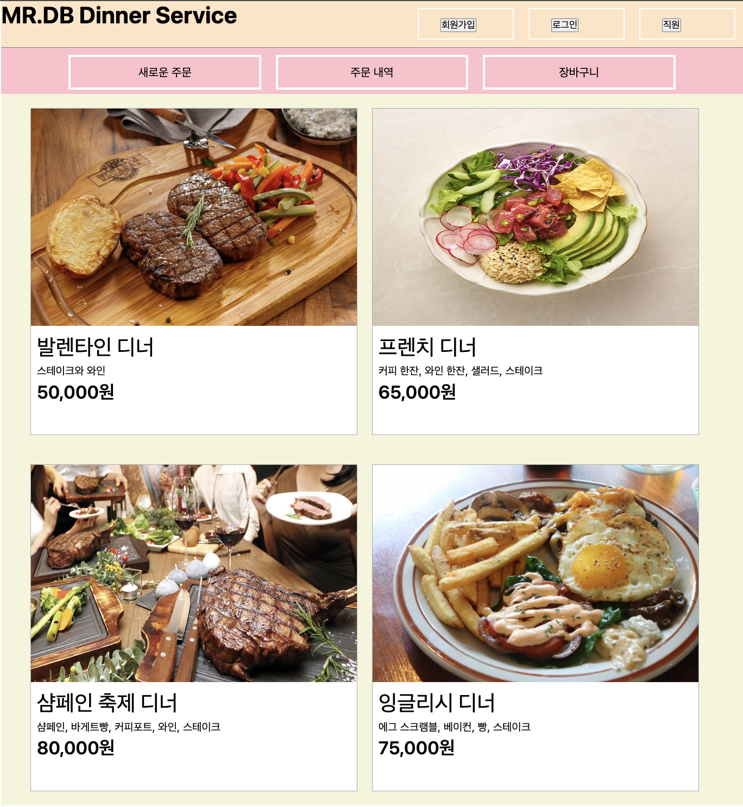
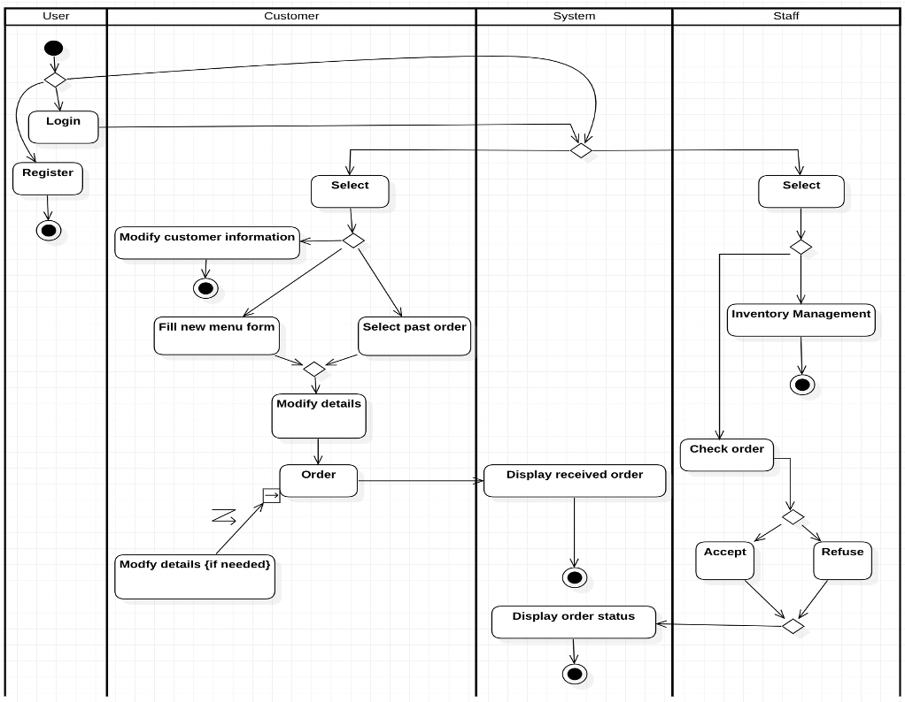
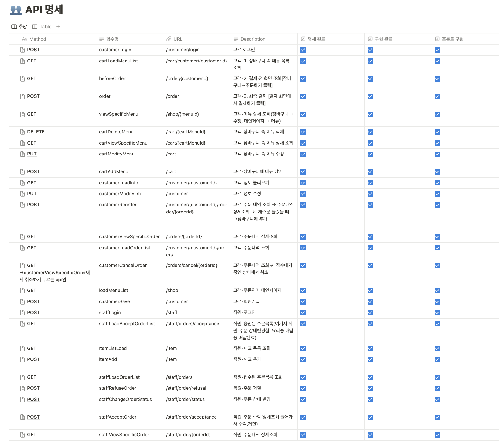
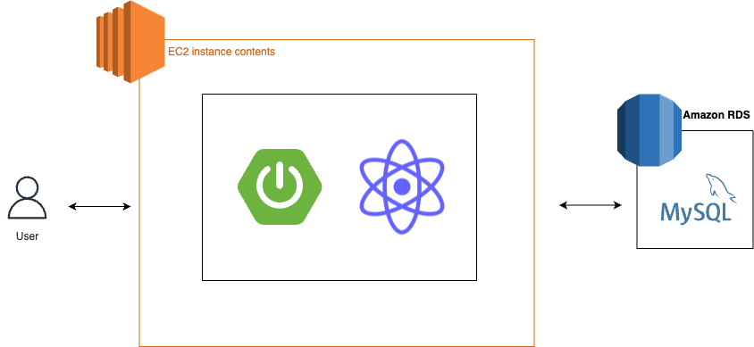

# 서울시립대학교 2022년도 2학기 소프트웨어공학
- 진행 기간: 2022. 09. ~ 2022. 12.
- 개발 인원: 
    - 프론트엔드: 1명
    - 백엔드: 2명

## 프로젝트 소개

### 배경
- 특별한 날에 집에서 의미있게 보낼 순 없을까?
    + 좋은 사람들과 근사하게 보내고 싶지만 많은 사람이 있는 곳으로 가긴 싫은 상황, 코로나에 걸리면 안되는 상황에서 의미있는 하루를 보내고 싶은 사람들의 행복을 위해 미스터 대박 디너 서비스를 개발하게됐다.

### 효과
- 집에서 근사한 저녁을 먹고싶은 고객을 위한 서비스 제공
- 불가피하게 집에 있어야 하는 고객의 만족도 증가
- 음성인식 주문을 통해 편리한 주문시스템 개발

## 기능
1. 로그인 및 회원가입
2. 음성인식
3. 주문
    - 과거 주문 내역 확인
    - 조리 시작 시 메뉴 수정 불가능
    - 단골 고객 할인 혜택
    - 비회원 주문 가능
4. 직원 
    - 재고 관리
    - 주문 관리
    
## 프로토타입

## 액티비티도

## ERD

## API 명세 [Notion으로 공동 작업]

## 프로젝트 아키텍처

## 문서화
[요구명세서](./docs/미스터대박디너서비스(2022_2)_수정본.pdf)

[프로젝트계획서](./docs/SE_02_추앙해_프로젝트계획.docx) (개요, 일정 관리, 개발 환경, 위험 관리)

[분석산출물](./docs/SE_02_추앙해_분석산출물.docx) (유즈케이스도, 액티비티도)

[설계산출물](./docs/SE_02_추앙해_설계산출물.doc) (아키텍처도, 클래스도, 교류도, 순차도, 객체 상태도)

[구현운영산출물](./docs/SE_02_추앙해_구현운영산출물.doc) (컴포넌트도, 배치도)